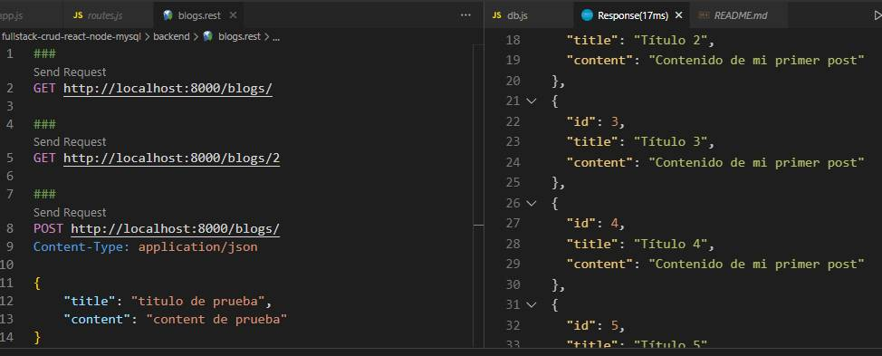

# FULL STACK APP WITH NODEJS, EXPRESS, SEQUELIZE ORM, MYSQL, REACT
Code to create API REST and testing with REST CLIENT.

## STACK TECH :wrench: :hammer:
* Node Js
* Express
* Mysql
* Extension VSCode REST CLIENT
* Sequelize ORM
* NPM 
* Nodemon
* React

# Commands to Backend with Nodejs + Express + Sequelize
1. npm init -y 
2. npm i express cors mysql2 sequelize
3. npm i nodemon --save-dev
  * nodemon app

# SCREENSHOT

Testing API REST with Rest Client Extension VSCODE
